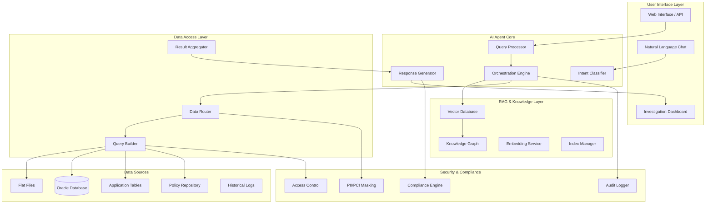

# AI Billing Investigation Agent - System Architecture

## High-Level Architecture

## Core Components

### 1. Query Processing Pipeline
- **Intent Classification**: Understand investigation type (single transaction, PAN-range, issuer-level)
- **Entity Extraction**: Identify PANs, amounts, dates, issuers, fee types
- **Query Planning**: Generate multi-step investigation plan
- **Context Management**: Maintain conversation context and investigation state

### 2. RAG System Design
- **Hybrid Retrieval**: Combine semantic search with structured queries
- **Multi-Source Indexing**: Unified indexing across all data sources
- **Knowledge Graph**: Relationships between transactions, rules, and policies
- **Contextual Embeddings**: Domain-specific embeddings for billing terminology

### 3. Data Access Strategy
- **Intelligent Routing**: Route queries to optimal data sources
- **Parallel Processing**: Concurrent data retrieval across systems
- **Result Fusion**: Combine and rank results from multiple sources
- **Caching Layer**: Intelligent caching for frequently accessed data

### 4. Security & Compliance Framework
- **Data Classification**: Automatic PII/PCI detection and masking
- **Role-Based Access**: Granular permissions based on analyst role
- **Audit Trail**: Complete audit log of all investigations
- **Compliance Validation**: Ensure outputs meet regulatory requirements

## Data Flow Architecture

### Investigation Flow
1. **Query Intake**: Natural language query received
2. **Intent Analysis**: Classify investigation type and extract entities
3. **Knowledge Retrieval**: Fetch relevant rules, policies, and historical cases
4. **Data Querying**: Execute optimized queries across data sources
5. **Result Synthesis**: Combine and analyze retrieved data
6. **Root Cause Analysis**: Identify discrepancies and root causes
7. **Response Generation**: Create explainable, evidence-grounded response
8. **Next Steps**: Provide recommended actions and similar cases

### Data Integration Patterns
- **Event-Driven Architecture**: Real-time data updates via event streams
- **Batch Processing**: Scheduled indexing of large datasets
- **Change Data Capture**: Continuous synchronization of database changes
- **API Gateway**: Unified access layer for all data sources

## Technology Stack

### Core AI/ML Components
- **LLM**: Mastercard-approved GenAI models (e.g., GPT-4, Claude)
- **Vector Database**: Pinecone/Weaviate for semantic search
- **Embedding Models**: Domain-specific billing embeddings
- **Knowledge Graph**: Neo4j for relationship mapping

### Data & Infrastructure
- **Database**: Oracle with optimized query patterns
- **File Processing**: Distributed file processing for PB-scale data
- **Streaming**: Kafka for real-time data updates
- **Cache**: Redis for high-performance caching

### Security & Governance
- **Data Masking**: Custom PII/PCI masking algorithms
- **Access Control**: OAuth 2.0 with fine-grained permissions
- **Audit Logging**: Immutable audit trails
- **Compliance**: Automated compliance checking

## Performance Considerations

### Scalability Design
- **Horizontal Scaling**: Stateless components for easy scaling
- **Data Partitioning**: Intelligent data partitioning for parallel processing
- **Load Balancing**: Intelligent query routing based on data location
- **Resource Management**: Dynamic resource allocation based on query complexity

### Optimization Strategies
- **Query Optimization**: Intelligent query planning and execution
- **Result Caching**: Multi-level caching strategy
- **Index Management**: Dynamic index optimization based on usage patterns
- **Connection Pooling**: Efficient database connection management

## Monitoring & Observability

### Key Metrics
- **Query Performance**: Latency, throughput, success rates
- **Data Quality**: Accuracy, completeness, consistency
- **User Satisfaction**: Response relevance, investigation success
- **System Health**: Resource utilization, error rates

### Monitoring Tools
- **APM**: Application performance monitoring
- **Logging**: Structured logging with correlation IDs
- **Metrics**: Real-time metrics collection and alerting
- **Tracing**: Distributed tracing for end-to-end visibility
