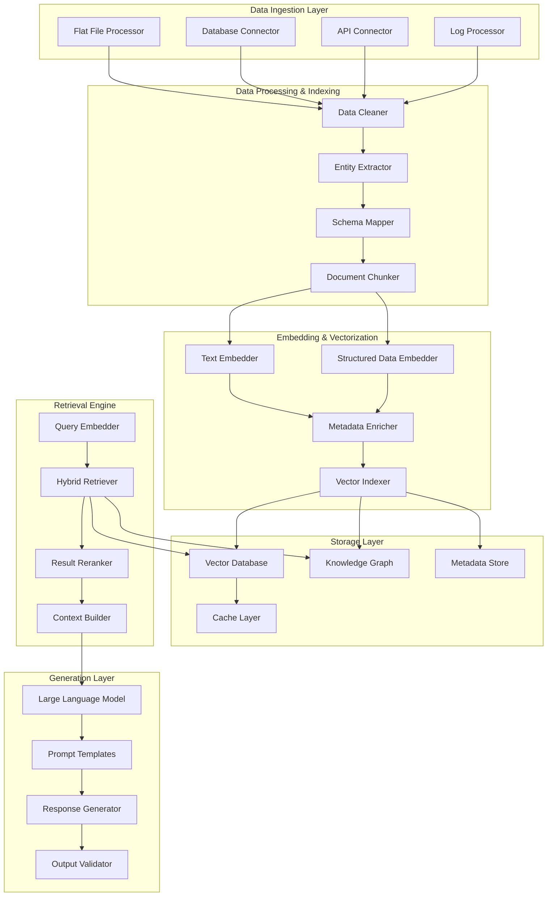

# RAG System Design for Billing Intelligence Agent

## Overview
The Retrieval-Augmented Generation (RAG) system is the core component that enables the AI agent to access and reason over Mastercard's vast billing data landscape. This design ensures accurate, context-aware responses while maintaining security and compliance.

## RAG Architecture

## Data Source Integration

### 1. Flat Files Processing
**Source Types:**
- Feeder files (transaction feeds)
- Batch outputs (billing results)
- Log files (application logs)
- Policy files (pricing rules)

**Processing Strategy:**
- **Schema Detection**: Automatic schema inference
- **Format Parsing**: Support for CSV, fixed-width, XML, JSON
- **Incremental Updates**: Process only new/changed files
- **Quality Validation**: Data quality checks and anomaly detection

### 2. Oracle Database Integration
**Key Tables:**
- Transaction tables (authorization, clearing, settlement)
- Billing tables (fee calculations, pricing)
- Reference tables (interchange rules, policies)
- Metadata tables (lineage, mappings)

**Retrieval Strategy:**
- **Query Optimization**: Intelligent query planning
- **Connection Pooling**: Efficient database connections
- **Result Streaming**: Handle large result sets
- **Caching**: Cache frequently accessed queries

### 3. Application Data Sources
**Data Types:**
- Configuration data (rule mappings)
- Lineage metadata (data flow tracking)
- Historical investigations (case studies)
- Policy documents (regulatory requirements)

## Embedding Strategy

### 1. Text Embeddings
**Content Types:**
- Policy documents and rules
- Historical investigation notes
- Error messages and logs
- Analyst comments and annotations

**Embedding Model:**
- Domain-specific fine-tuning on billing terminology
- Multi-lingual support for global operations
- Context-aware embeddings for billing concepts

### 2. Structured Data Embeddings
**Data Types:**
- Transaction records and metadata
- Database schemas and relationships
- Pricing rules and conditions
- Fee calculation logic

**Embedding Approach:**
- **Schema-Aware Embeddings**: Preserve data structure
- **Relationship Embeddings**: Encode table relationships
- **Temporal Embeddings**: Capture time-based patterns
- **Numerical Embeddings**: Handle amounts and quantities

### 3. Hybrid Retrieval
**Retrieval Methods:**
- **Semantic Search**: Vector similarity for unstructured data
- **Keyword Search**: BM25 for exact matches
- **Structured Queries**: SQL-like queries for structured data
- **Graph Traversal**: Knowledge graph navigation

**Fusion Strategy:**
- **Reciprocal Rank Fusion**: Combine multiple retrieval results
- **Query Expansion**: Expand queries with domain knowledge
- **Relevance Scoring**: Multi-factor relevance calculation
- **Diversity Promotion**: Ensure result diversity

## Knowledge Graph Design

### 1. Entity Types
**Core Entities:**
- **Transaction**: Authorization, clearing, settlement records
- **PAN/Card**: Cardholder and payment card information
- **Issuer**: Bank and financial institution data
- **Fee**: Billing fees and charges
- **Rule**: Pricing and interchange rules
- **Policy**: Regulatory and business policies

### 2. Relationship Types
**Key Relationships:**
- **HAS_TRANSACTION**: Card to transaction mapping
- **APPLIES_FEE**: Rule to fee application
- **GENERATED_BY**: Fee to rule generation
- **BELONGS_TO**: Transaction to issuer mapping
- **COMPLIES_WITH**: Rule to policy compliance
- **INVESTIGATED_IN**: Transaction to investigation cases

### 3. Graph Traversal Patterns
**Common Traversals:**
- **Transaction Investigation**: Transaction → Rules → Fees → Policies
- **PAN-Range Analysis**: Card → Transactions → Common Patterns
- **Rule Impact**: Rule → Affected Transactions → Fees
- **Policy Compliance**: Policy → Rules → Implementation Status

## Context Management

### 1. Context Building
**Context Components:**
- **Query Context**: User intent and extracted entities
- **Data Context**: Retrieved relevant data
- **Historical Context**: Similar past investigations
- **Policy Context**: Applicable rules and regulations

### 2. Context Optimization
**Optimization Strategies:**
- **Relevance Filtering**: Keep only highly relevant context
- **Length Management**: Optimize context for LLM limits
- **Temporal Ordering**: Chronological context organization
- **Hierarchical Structuring**: Logical context organization

### 3. Context Caching
**Caching Strategy:**
- **Query Pattern Caching**: Cache common query patterns
- **Result Caching**: Cache retrieval results
- **Context Caching**: Cache built contexts
- **TTL Management**: Time-based cache invalidation

## Retrieval Optimization

### 1. Index Management
**Index Types:**
- **Vector Indexes**: HNSW for semantic search
- **Keyword Indexes**: Inverted indexes for text search
- **Structured Indexes**: Database indexes for queries
- **Graph Indexes**: Graph traversal indexes

### 2. Query Planning
**Planning Strategies:**
- **Query Decomposition**: Break complex queries into sub-queries
- **Parallel Execution**: Execute sub-queries in parallel
- **Result Merging**: Combine partial results efficiently
- **Cost Estimation**: Estimate query costs for optimization

### 3. Performance Optimization
**Optimization Techniques:**
- **Pre-filtering**: Reduce search space before retrieval
- **Post-filtering**: Apply filters after retrieval
- **Batch Processing**: Process multiple queries together
- **Load Balancing**: Distribute retrieval load

## Quality Assurance

### 1. Retrieval Quality Metrics
**Key Metrics:**
- **Precision**: Relevant results / Total results
- **Recall**: Relevant results / All relevant items
- **F1-Score**: Balance of precision and recall
- **MRR**: Mean Reciprocal Rank
- **NDCG**: Normalized Discounted Cumulative Gain

### 2. Quality Monitoring
**Monitoring Aspects:**
- **Retrieval Performance**: Track retrieval quality over time
- **User Feedback**: Collect user relevance feedback
- **System Health**: Monitor system performance metrics
- **Data Quality**: Track data quality issues

### 3. Continuous Improvement
**Improvement Strategies:**
- **Embedding Updates**: Regularly update embedding models
- **Index Optimization**: Continuously optimize indexes
- **Query Analysis**: Analyze query patterns for improvements
- **A/B Testing**: Test different retrieval strategies

## Security & Compliance in RAG

### 1. Data Protection
**Protection Measures:**
- **PII Masking**: Automatic detection and masking of sensitive data
- **Access Control**: Role-based access to retrieved data
- **Encryption**: Encrypt stored vectors and metadata
- **Audit Logging**: Log all retrieval operations

### 2. Compliance Features
**Compliance Aspects:**
- **Data Residency**: Ensure data stays within required regions
- **Retention Policies**: Implement data retention policies
- **Regulatory Compliance**: Ensure compliance with PCI DSS, GDPR
- **Privacy Protection**: Protect customer privacy in retrievals

### 3. Security Controls
**Security Measures:**
- **Authentication**: Secure user authentication
- **Authorization**: Fine-grained access control
- **Input Validation**: Validate all retrieval inputs
- **Output Filtering**: Filter sensitive information from outputs
