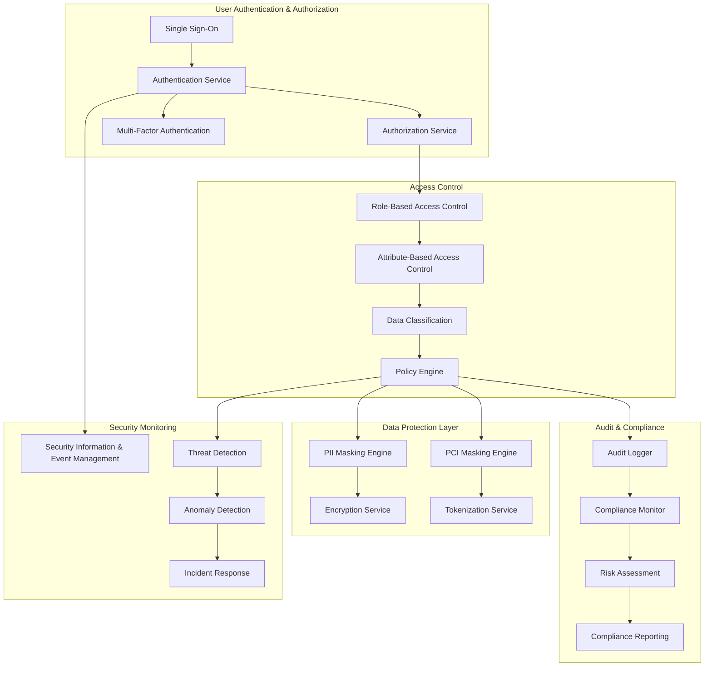

# Security & Compliance Framework

## Overview
The AI Billing Investigation Agent operates within Mastercard's strict security and compliance boundaries. This framework ensures PCI DSS compliance, PII protection, and adherence to Mastercard's AI governance policies.

## Security Architecture



## PCI DSS Compliance

### 1. PCI Data Classification
**Cardholder Data (CHD):**
- Primary Account Number (PAN)
- Cardholder Name
- Service Code
- Expiration Date

**Sensitive Authentication Data (SAD):**
- Full magnetic stripe data
- CAV2/CVC2/CVV2
- PINs/PIN blocks

**Protection Requirements:**
- **PAN**: Masking except for first 6 and last 4 digits
- **SAD**: Never stored, processed only when necessary
- **CHD**: Encryption at rest and in transit

### 2. PCI Compliance Controls
**Technical Controls:**
- **Encryption**: AES-256 for data at rest, TLS 1.3 for data in transit
- **Tokenization**: Replace PAN with tokens in non-production environments
- **Access Control**: Least privilege access to cardholder data
- **Audit Logging**: All access to CHD logged and monitored

**Process Controls:**
- **Data Minimization**: Collect only necessary PCI data
- **Retention Policies**: Strict data retention schedules
- **Regular Assessments**: Quarterly PCI compliance assessments
- **Training**: Annual security awareness training

### 3. PCI Data Masking Strategy
**Masking Rules:**
```python
# PAN Masking: 1234567890123456 -> 123456******3456
def mask_pan(pan: str) -> str:
    if len(pan) >= 12:
        return pan[:6] + '*' * (len(pan) - 10) + pan[-4:]
    return '*' * len(pan)

# Name Masking: JOHN DOE -> J*** D**
def mask_name(name: str) -> str:
    parts = name.split()
    masked_parts = []
    for part in parts:
        if len(part) > 1:
            masked_parts.append(part[0] + '*' * (len(part) - 1))
        else:
            masked_parts.append('*')
    return ' '.join(masked_parts)
```

## PII Protection

### 1. PII Data Types
**Identifiable Information:**
- Personal identifiers (name, address, phone)
- Financial information (account numbers, balances)
- Transaction details (amounts, dates, locations)
- Behavioral data (spending patterns, preferences)

**Protection Categories:**
- **Direct Identifiers**: Name, SSN, driver's license
- **Indirect Identifiers**: IP address, device ID
- **Quasi-Identifiers**: Age, gender, location
- **Sensitive PII**: Health, financial, biometric data

### 2. PII Detection & Classification
**Detection Methods:**
- **Pattern Matching**: Regex patterns for common PII formats
- **Machine Learning**: ML models for PII classification
- **Context Analysis**: Understand context to identify PII
- **Manual Review**: Human validation for edge cases

**Classification Levels:**
- **High Sensitivity**: Direct identifiers, financial data
- **Medium Sensitivity**: Indirect identifiers, transaction data
- **Low Sensitivity**: Aggregated, anonymized data

### 3. PII Masking Implementation
**Masking Techniques:**
- **Redaction**: Complete removal of sensitive data
- **Tokenization**: Replace with random tokens
- **Generalization**: Replace with categories (e.g., age ranges)
- **Pseudonymization**: Replace with artificial identifiers

## Access Control Framework

### 1. Role-Based Access Control (RBAC)
**User Roles:**
- **Billing Analyst**: Basic investigation access
- **Senior Analyst**: Advanced investigation tools
- **Team Lead**: Team management and oversight
- **Administrator**: System administration
- **Auditor**: Read-only audit access

**Permission Matrix:**
| Role | View Data | Export Data | Modify Rules | Admin Functions |
|------|-----------|-------------|--------------|-----------------|
| Billing Analyst | Limited | No | No | No |
| Senior Analyst | Full | Yes | Limited | No |
| Team Lead | Full | Yes | Yes | No |
| Administrator | Full | Yes | Yes | Yes |
| Auditor | Read-only | No | No | No |

### 2. Attribute-Based Access Control (ABAC)
**Access Attributes:**
- **User Attributes**: Role, department, clearance level
- **Resource Attributes**: Data sensitivity, classification, owner
- **Environment Attributes**: Location, time, device type
- **Action Attributes**: Read, write, export, delete

**Policy Examples:**
```yaml
# Policy: Allow billing analysts to view transactions from their region
- effect: allow
  actions: [read]
  resources: [transactions]
  conditions:
    and:
      - attribute:
          name: user.role
          value: billing_analyst
      - attribute:
          name: user.region
          operator: equals
          value: resource.region
```

### 3. Data Classification & Labeling
**Classification Levels:**
- **Public**: No restrictions
- **Internal**: Mastercard internal use only
- **Confidential**: Restricted to authorized personnel
- **Restricted**: Highest security level

**Labeling Scheme:**
- **Automatic Classification**: ML-based classification
- **Manual Classification**: User-defined classification
- **Inheritance**: Classification from parent data
- **Propagation**: Classification to derived data

## Audit & Compliance

### 1. Comprehensive Audit Logging
**Log Categories:**
- **Authentication Logs**: Login attempts, failures, MFA
- **Authorization Logs**: Access control decisions
- **Data Access Logs**: Data queries, retrievals, exports
- **System Logs**: System events, errors, performance

**Log Format:**
```json
{
  "timestamp": "2024-01-15T10:30:00Z",
  "user_id": "analyst_123",
  "action": "data_query",
  "resource": "transactions",
  "result": "success",
  "details": {
    "query_type": "billing_investigation",
    "data_accessed": ["pan_masked", "transaction_amount"],
    "duration_ms": 1250
  },
  "compliance_flags": ["pci_masked", "pii_protected"]
}
```

### 2. Compliance Monitoring
**Monitoring Aspects:**
- **PCI Compliance**: Continuous PCI DSS compliance checking
- **Data Protection**: PII handling compliance
- **Access Control**: Unauthorized access attempts
- **Data Retention**: Retention policy compliance

**Alerting Rules:**
- **High Priority**: Security breaches, data exfiltration
- **Medium Priority**: Policy violations, unusual access patterns
- **Low Priority**: Configuration changes, performance issues

### 3. Regulatory Reporting
**Report Types:**
- **Daily Reports**: Security incidents, access violations
- **Weekly Reports**: Compliance status, risk assessments
- **Monthly Reports**: Audit summaries, trend analysis
- **Quarterly Reports**: PCI assessments, regulatory filings

## AI Governance Compliance

### 1. Mastercard AI Governance Framework
**Governance Principles:**
- **Transparency**: Explainable AI decisions
- **Fairness**: Unbiased treatment across all users
- **Accountability**: Clear responsibility for AI outcomes
- **Privacy**: Protection of personal and sensitive data

**Compliance Requirements:**
- **Model Documentation**: Complete model documentation
- **Bias Testing**: Regular bias assessment and testing
- **Performance Monitoring**: Continuous model performance tracking
- **Human Oversight**: Human review for critical decisions

### 2. Model Explainability
**Explainability Features:**
- **Decision Trees**: Clear decision paths
- **Feature Importance**: Understanding key factors
- **Counterfactuals**: What-if scenarios
- **Confidence Scores**: Reliability indicators

**Implementation:**
```python
class ExplainableBillingAgent:
    def investigate_with_explanation(self, query: str) -> InvestigationResult:
        # Generate investigation result
        result = self.process_query(query)
        
        # Generate explanation
        explanation = {
            "decision_path": self.get_decision_path(query),
            "key_factors": self.get_feature_importance(query),
            "confidence": self.calculate_confidence(result),
            "similar_cases": self.find_similar_cases(query),
            "rules_applied": self.get_applied_rules(query)
        }
        
        return InvestigationResult(result=result, explanation=explanation)
```

### 3. Bias Detection & Mitigation
**Bias Detection:**
- **Data Bias**: Analyze training data for biases
- **Model Bias**: Test model outputs for fairness
- **Feedback Bias**: Monitor user feedback for bias patterns
- **Temporal Bias**: Track bias changes over time

**Mitigation Strategies:**
- **Balanced Training**: Ensure representative training data
- **Regularization**: Apply fairness constraints
- **Post-processing**: Adjust outputs for fairness
- **Human Review**: Manual review of biased outcomes

## Incident Response

### 1. Security Incident Response
**Incident Types:**
- **Data Breach**: Unauthorized data access
- **System Compromise**: System security breach
- **Insider Threat**: Malicious insider activity
- **Compliance Violation**: Regulatory non-compliance

**Response Process:**
1. **Detection**: Identify security incident
2. **Assessment**: Evaluate impact and scope
3. **Containment**: Limit incident spread
4. **Eradication**: Remove threat sources
5. **Recovery**: Restore normal operations
6. **Lessons Learned**: Post-incident analysis

### 2. Business Continuity
**Continuity Measures:**
- **Backup Systems**: Redundant systems and data
- **Disaster Recovery**: DR plans and procedures
- **Failover Testing**: Regular failover testing
- **Documentation**: Comprehensive documentation

### 3. Security Training
**Training Programs:**
- **Security Awareness**: Basic security practices
- **PCI Training**: PCI DSS compliance training
- **Data Privacy**: Privacy protection training
- **Incident Response**: Response procedure training

## Technology Implementation

### 1. Security Stack
**Security Technologies:**
- **Identity & Access**: Azure AD, Okta
- **Encryption**: Azure Key Vault, AWS KMS
- **Monitoring**: Splunk, Azure Sentinel
- **Compliance**: OneTrust, LogicGate

### 2. Data Protection Tools
**Protection Technologies:**
- **Masking**: Custom masking algorithms
- **Tokenization**: HashiCorp Vault
- **Encryption**: OpenSSL, Azure Encryption
- **Access Control**: Apache Ranger

### 3. Compliance Automation
**Automation Tools:**
- **Policy Enforcement**: Open Policy Agent
- **Compliance Scanning**: Chef InSpec
- **Audit Automation**: Custom audit scripts
- **Reporting**: Power BI, Tableau
